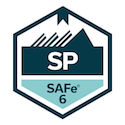

  <strong>Hey! I'm Tom.</strong> I'm a six-year Army veteran and life-long student with a passion for technology. I've traveled the world and worked in various fields, gaining diverse experiences that have shaped my career and mindset. As a data engineer and full-stack software developer, I am dedicated to leveraging my curiosity, passion, and drive to build innovative and efficient solutions.

  Throughout my career, I have consistently studied and applied software development, DevOps, and data engineering principles, always eager to learn and adapt to new technologies. I believe that technology is an integral part of our everyday lives, and this fact continues to inspire and motivate me to grow as a professional.

  I am always eager to learn and collaborate on all things software engineering! Let's connect and explore how we can work together to drive innovation and success.

 

<h2 align="center">Data Engineering</h2>
  

    
    
    
    
  

 

<h2 align="center">Full-Stack Software Development</h2>
  

    
    
    
    
  

  

    
    
    
  

 

<h2 align="center">Cloud/Containerization</h2>
  

    
    
    
  

 

<h2 align="center">Certifications</h2>

  
  

 

<h2 align="center">Connect with me!</h2>

  
  
  

 

<h2 align="center">Stats ⚡</h2>

  <picture>
  <source
    srcset="https://github-readme-stats.vercel.app/api?username=chiltom&show_icons=true&theme=dracula"
    media="(prefers-color-scheme: dark)"
  />
  <source
    srcset="https://github-readme-stats.vercel.app/api?username=chiltom&show_icons=true&theme=gruvbox_light"
    media="(prefers-color-scheme: light), (prefers-color-scheme: no-preference)"
  />
  
</picture>

 
